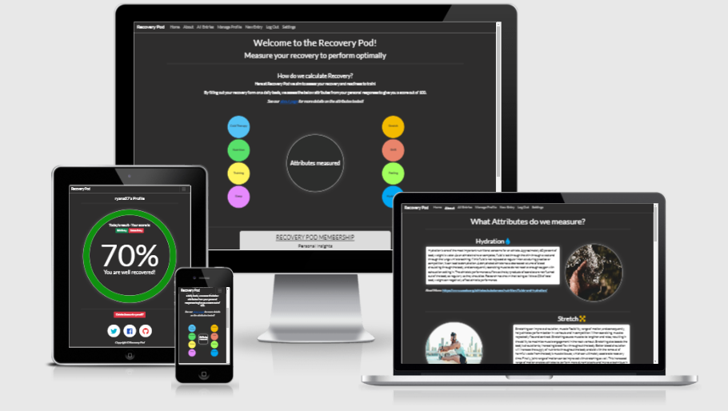
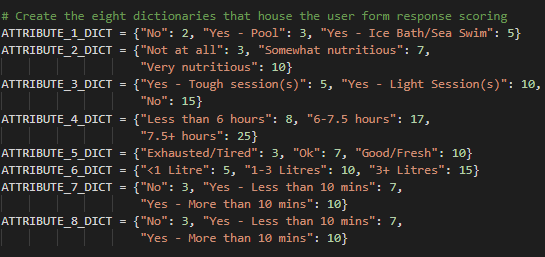

<h1 align = "center">Recovery Pod</h1>

View the live project at the following [link](https://recovery-pod.herokuapp.com/).

We are seeing a massive rise in Athlete’s understanding of how recovery plays an impact in areas such as performance, mood regulation and general wellbeing. Applications such as Whoop, Output Sports and Apex Athlete Series have done phenomenally well in the last number of years in areas such as sleep monitoring, load measuring and performance-based metrics. However, the true use of these sites is often stuck behind a massive paywall and require expensive equipment. 

Although most people that are involved in sports performance often view their recovery as “Am I sore?”, this is only one of the key metrics that have been proven to factor into the recovery equation. Hydration, Sleep, Nutrition, etc. play a huge role in determining an Athlete’s readiness and often willingness to train and are often overlooked by the non-elite.

In response to this, I wanted to create a site that allows the user to figure out “How recovered am I today?” through a form submission with multiple questions, allowing them to visually see their recovery score. They can therefore login every day, fill in this form and plan their training accordingly based on how recovered they are.

The aim of this site is to allow the user of the site to calculate their recovery score. Users will experience:
*	a welcome/about page where the user can create an account/login and view the metrics that the site determines for their score
*	Full CRUD (Create/Read/Update/Delete) functionality
*	a delete account feature
*	password reset feature
*	View external sources of information of the attributes measured
*	Submission of a form which will calculate the user recovery score based on answers to their questions
*	A managing of their profile, which will include their score for the today, as well as an “edit/delete” entry if any mistake on their entry was made 
*	A log out section
*	View the entries of everyone that has an account, including a search bar that users can see all the scores of an entered username
*	A green/yellow/red recovery colouring scheme that allows high-impact colouring across the site

The site is designed to be responsive and accessible across all device sizes, as defined in the testing section of this ReadMe file.
The design is to be a front end data-driven web application with a non-relational database-backed Flask application, which allows users to store and manipulate data records about a particular domain.
The site is also designed to handle the full suite of user management, as defined in the Information architecture of this ReadMe file.

## Table of Contents
* [Site Owner and Product/Business Goals](#site-owner-and-productbusiness-goals)
* [Developer goals](#developer-goals)
* [First Time Visitor Goals](#first-time-visitor-goals)
* [Returning and Frequent Visitor Goals](#returning-and-frequent-visitor-goals)
* [Attributes measured and their importance](#attributes-measured-and-their-importance)
* [User Experience (UX)](#user-experience-ux)
  * *The 5 planes of User Experience – Decisions and Reasons*
   1.	[Strategy plane](#strategy-plane)
   2.	[Scope plane](#scope-plane)
   3.	[Structure plane](#structure-plane)
   4.	[Skeleton plane](#skeleton-plane)
   5.	[Surface plane](#surface-plane)
   
  *	[Who/ What/ How](#who-what-how)
  *	[User stories](#user-stories)

* [Design Features](#design-features)
  1. [Wireframes](#wireframes)
  2.	[Typography](#typography)
  3.	[Colour scheme](#colour-scheme)
  4.	[Imagery](#imagery)
  5.	[Visual Hierarchy](#visual-hierarchy)
  6.	[Features implemented](#features-implemented)
  7.	[Features left to implement](#features-left-to-implement)

* [Design & UX – How do they come together?](#design--ux--how-do-they-come-together)
  * [User goals](#user-goals)
  * [Site owner goals](#site-owner-goals)
  * [Designer goals](#designer-goals)

* [Information Architecture?](#information-architecture)
  * [How CSS created an experience](#how-css-created-an-experience)
  *	[How JS created an experience](#how-js-created-an-experience)
  *	[How Python created an experience](#how-python-created-an-experience)
  *	[Site Logic and diagram](#site-logic-and-diagram)
  *	[User Types and permissions](#user-types-and-permissions)
  *	[CRUD Functionality](#crud---create-read-update-and-delete)
  *	[Mongo DB Database Structure](#mongo-db-database-structure)
  *	[Metric scoring](#metric-scoring)
  *	[Python logic - Brief](#python-logic---brief)

* [Technology and Languages used](#technology-and-languages-used)
  *	[Languages](#languages)
  *	[Frameworks, Libraries and Programmes](#frameworks-libraries-and-programmes)

* [Testing](#testing)
  * [Code validation](#code-validation)
  * [Accessibility testing](#accessibility-testing)
  * [Responsive testing](#responsive-testing)
  * [Manual testing](#manual-testing)
  * [Testing user stories from User Experience (UX) section](#testing-user-stories-from-user-experience-ux-section)
  * [Known bugs](#known-bugs)

* [Deployment](#deployment)
  * [Process of deployment](#process-of-deployment)
  * [How to run this project locally](#how-to-run-this-project-locally)

* [Credits](#credits)
  * [Content](#content)
  * [Media](#media)
  * [Code](#code)
  * [Acknowledgements](#acknowledgements)

## Site Owner and Product/Business Goals
As the site owner, the website is to act as a hub for all athletes/users who create an account, allowing them to:
*	Create an account/login with a password reset/delete account feature
*	Have a welcome page where the users can view the attributes measured as well as insights as to what they can experience when they create an account
*	In the welcome page (where the user has not yet created an account), redirect buttons to prompt the user to create an account
*	View in more detail the attributes measured along with “importance” narrative, referencing an external link which the user can click on to read further details of the attribute importance
*	View all entries of other athlete’s including the green/yellow/red scoring of such entries. A search bar function to filter by an athlete’s username is also present
*	A log out function
*	A settings function where the user can change their password
*	A “new entry” feature where the site user can input today’s recovery score via a form asking questions across the attributes measured
*	A “manage profile” function where the user can: see today’s score with appropriate large colouring; edit/delete entry; see the narrative of their score; delete their account if they wish

The site is to achieve the following goals:
1.	The site is presented in an efficient and authentic way so that the users can quickly create an account and log their recovery score
2.	The information on the site is displayed clearly and contain all the information necessary for the user to understand the purpose of the site and how their recovery score is calculated
3.	Provide feedback to the users using colouring of green/yellow/red on today’s recovery score
4.	Is responsive on all device sizes
5.	Utilize Python/JavaScript to allow seamless user transition throughout the site and their profile
6.	Creates a positive experience for the user using colour, imagery and layout
7.	Become a hub for athletes to utilize in determining their recovery metrics
8.	To display the content in a culturally appropriate attested to the audience it is aimed at

## Developer goals
As the developer, the site is to achieve the following goals:
1.	Mar the goals of the site owner and user together
2.	Create a positive experience for both parties using the specifications required by both parties
3.	Achieve responsive design across all devices
4.	Utilize the combination of HTML, CSS, JavaScript and Python to enhance the experience of the user and site owner
5.	Become a hub for athletes to utilize in determining their recovery metrics
6.	Allow “administrator” access to manage user profiles in full

## First-Time Visitor Goals
As a first-time visitor of the site, I want:

1.	My impression of the site to be a positive experience
2.	To understand the main purpose of the site
3.	To provide relevant content related to athlete recovery and the main metrics of score calculation
4.	A clear and unambiguous layout, including a clear recovery score after my form submission
5.	CRUD functionality upon account/entry creation
6.	A quick “create account” feature on landing on the site
7.	An instant feedback loop from form submission to the recovery score of the day
8.	Easy navigation of the site
9.	Built-in safety protocols – single entries, user authentication, appropriate redirects
10.	The ability to edit/delete my entry for the day
11.	The ability to delete my account
12.	To view the recovery score of the day to clearly see how recovered I am
13.	The colours, layout and feel of the site to be of an athlete nature as part of cultural appropriation

## Returning and Frequent Visitor Goals
1.	CRUD functionality on my profile
2.	To explore the more information on the attributes that are measured

## Attributes measured and their importance
The following are the attributes measured by the site:
1.	Cold therapy
2.	Nutrition
3.	Training
4.	Sleep
5.	Stretch
6.	SMR (Self myofascial release)
7.	Feeling
8.	Hydration

The above attributes are present in a “columned” format on the home page of the site, allowing site visitors to see them as the metrics very quickly. On the about page of the site, each of these attributes are broken down further which allow the site user to quickly see narrative of their importance, including a link for further information should the user wish to read more.
From my background in strength & conditioning, these attributes (whilst they are not the exhaustive full list) represent the key list of measurements that many of the top athlete’s around the world measure daily in terms of their recovery. For further information on how the calculation is performed, please see the Information architecture -> Metric scoring section of this ReadMe file.

## User Experience (UX)
### _The 5 planes of User Experience – Decisions and Reasons_
#### Strategy Plane

Question |	Response for site design
-------- | ---------
Is the content culturally appropriate? |	Design will be simplistic in terms of UX and is based on leading athlete load monitoring sites– Dark background and light “pop” information that allow athlete’s to visually see scoring very quickly
Is the content relevant? |	Acting as an athlete hub, only relevant “Recovery” content will be displayed
Can we provide content in an intuitive way? |	The site will have a series of prompts/redirects/buttons and, using Python and JavaScript, will feel interactive to the site user
Is the technology appropriate? |	Since Recovery Pod is essentially a rules-based scoring system with CRUD functionality, Python is the primary source of technology for the site back-end. A combination of CSS and JavaScript will be used for applicable user experience on the front-end
Who is my target audience? |	Athlete’s/general fitness enthusiasts who want to see how recovered they are
Product considerations |	No overload of content/imagery on the site as per appropriation. Recovery Pod is a database-driven CRUD site and hence the content should reflect that. Clear feedback loops from user account creation/CRUD usage/entry creation must be present. Navigation/layout must be easy across all devices for the users

##### Strategy feasibility scoping
Opportunity |	Importance |	Feasibility
-------- | --------- | -----------
Ability to see all entries and search by username | 4 | 5
CRUD functionality on user entry for the day | 5 | 5
Seamlessly move the page when the user “clicks” the button | 5 | 5
Feedback loops on CRUD Functionality | 5 | 5
Feedback loops on form submission | 5 | 5
Daily email reminder to submit an entry | 4 | 2
Instructions on how create an account | 4 | 5
Attributes importance and their sources | 4 | 4
Further inputs for the user to manage – heart rate/ HRV | 3 | 2
Password changing | 5 | 5
Machine learning on user submission – e.g. when you do X, your recovery moves +/-% | 3 | 1
Delete account | 5 | 5
Weekly/monthly recovery score charts/suggestions | 4 | 2
Administrator functionality to manage user profiles | 5 | 5
Pagination on all entries | 3 | 2
User error handling – 404/500 errors, entry duplication safety measures, appropriate redirects on user interaction | 5 | 5

#### Scope Plane
What's in? |	What's out?
-------- | ---------
Ability to see all entries and search by username | Further inputs for the user to manage – heart rate/ HRV
CRUD functionality on user entry for the day | Machine learning on user submission – e.g. when you do X, your recovery moves +/-%
Seamlessly move the page when the user “clicks” the button | Weekly/monthly recovery score charts/suggestions
Feedback loops on CRUD usage | Daily email reminder to submit an entry
Feedback loops on CRUD Functionality | Pagination on all entries
Feedback loops on form submission | Forgot password email reset
Instructions on how create an account
Attributes importance and their sources
Password changing
Delete account
Administrator functionality to manage user profiles
User error handling – 404/500 errors, entry duplication safety measures, appropriate redirects on user interaction

#### Structure Plane
Question |	Response for site design
-------- | ---------
How do I navigate easily? | Navbar is present across all site pages and is fixed to the top. Pages present on the navbar will depend on the following: Unregistered user - On the home page, prompt to create an account/login. The about page is present regardless of user status. Registered user – As above but including navbar links for All entries/ manage profile of the user/ New entry, Log out and User settings page. Administrator – As above but including a navbar link for managing profiles present on the site. Throughout, buttons are present on the appropriate areas to allow the user to bring them to the features they wish to implement on the site.
How is the information presented? | Using athlete style colours/features and text content that allow the user to achieve their goals. Dark background to light interface for a clear separation of colours to the users and their related scores. Clear feedback on the result of form submission and their score for today. Flash feature from Python utilised whenever the user performs CRUD functionality. The buttons through the site pop to the user, clearly demonstrating what will happen should they click on them.
State changes | There is a clear state change at the navbar level depending on the user of the site as previously mentioned – no account, registered user, administrator. Appropriate redirects are present when the user interacts with both the navbar and the buttons of the site, including “reset” after a user searches for a username in the “All entries” page. On form submission, a clear state change redirects the user back to their profile which allows them to see their recovery score for the form they just submitted. Finally, state changes are present on all CRUD function buttons when the user interacts with them along with the Flash messages, tying in with the feedback loop that the user action was performed successfully.
Is the site consistent? | Correct styling and fonts are applied throughout the site, which was achieved using the Jinja templating language feature through Python and HTML. Colouring on the user score for the day and the “all entries” score is consistent between pages.
Is the site predictable? | All navigation is familiar to the user in terms of font/styling consistency.
Is the site appropriately visible? | See the testing/visual hierarchy section of this ReadMe file for visibility testing.
How does the user know to scroll/what to do? | The steps between a “First time visitor” and “First Recovery Score Entry” are adequately displayed and clear for the user.
How does the user if they are recovered? | Upon the day’s form submission, Python will correctly calculate the user’s score based on the form entry selections that they made. This instantaneous recalculation redirects the user back to their profile where their score and appropriate narrative is displayed. The user score, along with the afore mentioned green/yellow/red colouring pattern, displays in a giant circle on their profile. This size/colour emphasis upon form submission is a key feature to the user on whether they are recovered. Please see the Information architecture -> Metric scoring section of this ReadMe file for further information on this.
What if a user makes a mistake on their entry? What if they try to submit twice on the one day? | CRUD functionality is present on the user’s entry that they made for today – if the user wants to edit/delete the entry they just made, buttons are present for the user to perform this action. Note that an “onlick” event occurs to confirm this choice. If the user tries to input another entry, Python logic will determine that “today’s” entry has already been made along with an immediate redirect to the user profile and a flash message. This will prompt the user that the only way to create an entry is either delete the existing one or edit it. Further, if the user tries to edit an entry and has second thoughts – a cancellation button on the edit is presented and the original entry is valid.
How will the user know if they have an entry for today? | When the user views the profile and they have not made an entry for today, a message displays indicating that the user should make today’s entry.
User error – what if it happens? | Providing information to the user if this happens, and how to safely navigate back to the home page.
Information architecture | Using the tree structure with no more than 3 clicks for the user to reach a destination.

#### Skeleton Plane
Question |	Response for site design
-------- | ---------
How will the users get around? | Easy navigation for the user depending on their “status” as mentioned in the structure plane. Using call to action buttons/flash messages along with CRUD functionality that display the correct route the user should take depending on their chosen action.
How will I present the content? | Following industry norms of the header -> content -> footer approach across all pages. Jinja templating allows consistent site content to be present in this regard.
How do I show relevant content? | By making the content audience appropriate as defined by the site user goals. By using representational material/attributes which the user is expects with from previously managing their personal recovery.
How do I make the experience a positive one? | Through listening to the user goals, the content on the webpage is to provide appropriate recovery information for athletes each day that they log in. The use of Jinja templating/Python functionality displays consistent information and styling through the site, with appropriate messages/prompts to the user to “See how recovered you are”. The form submission the user completes daily is simple and consistent, allowing the user to see the metrics the site uses and how they can improve their recovery score over time. The cursor pointer and various text effects will be involved in producing a further positive response from the user. The state changes noted in the structure plane also discuss effects on the result of CRUD uses by the site user.
How do I structure the features and usability? | Non-registered account: Home/About/Login/Create account navbar links and prompt buttons on the home page. Registered user: View all entries,	Submit my own entry,	View my recovery score,	Manage/Edit today’s entry,	Delete account,	Password resetting

#### Surface Plane
Question |	Response for site design
-------- | ---------
What is the visual language? |	Jinja templating as noted above. Colouring as per testing norms, layout is informative, Fonts as per media display standard, images/recovery scores are clear and pop to the user, CTA buttons for site progression, JavaScript for score colouring and “active” page on site.
What is the economy? |	The most important user/owner elements are easily recognised
Readability and consistency |	Each site page is familiar to the user in terms of font/styling consistency

### _Who/ What/ How_
**Who is it for?** Users who want to understand metrics of athlete recovery, see their own recovery scores through form submission and improve their scores over time

**What is it for?** Users who want to recover correctly each day

**How will it achieve this?** Through creating a Recovery Pod site, and through Python/JavaScript/CSS/HTML, allow the user to log their recovery scores and see how recovered they are for the day

### _User Stories_
Performance is dictated by readiness, and this readiness can be boosted by taking the correct measures throughout the day.

Hence, I want a site where I can:
1.	Create my own personal account for the Recovery Pod.
2.	Learn about the attributes of recovery
3.	Navigate easily
4.	See if I’m recovered or not
5.	See other user’s recovery scores
6.	Perform CRUD functionality on my entry for the day
7.	Change my password/delete my account
8.	Login/Logout

#### Wireframes
* Desktop/tablet wireframe - [attached](static/rm_files/wireframe-desktop-tablet.pdf)
* Mobile wireframe - [attached](static/rm_files/wireframe-mobile.pdf)

#### Typography
Lato is used as the main font on the site, as imported through Google Fonts. Sans-serif is used as the fallback font. According to an article on [perpetual media group](http://www.perpetualmediagroup.ca/tenbestfontsforprintandweb/):
_“The semi-rounded details of the letters give Lato a feeling of warmth, while the strong structure provides stability and seriousness.”_

Further, in this [blog post](https://www.justinmind.com/blog/best-google-web-fonts-website/), Lato is ranked as #1 on the “30 best Google Fonts for your website”. It is known that the designer of this font, Lukasz Dziedzic, _“created Lato to work transparently in body text and also to stand out individually when used in larger-sized titles”_.
With these descriptions in mind, Lato is used for the site design/accompanying text.

#### Colour Scheme
The main colours used on the site are a shade of black and white:
* Background: rgb(46, 45, 45) (grey/black)
* Text colour: rgb(255,255,255) (white)
The reason for this is to achieve a “pop” effect on the icons and text presented, making them appeal more to the screen reader. 

According to [designwebkit](https://designwebkit.com/design/gaming-website-templates-professional-tips-build-game-website/#:~:text=As%20you%20may%20notice%2C%20most,brown%2C%20grey%2C%20and%20khaki.):

_“Most popular websites use dark colour scheme for their websites to create a mystic and engaging ambiance. The most popular colours for such websites are black, brown, grey, and khaki”._

Further colourings used on the site:

Footer links:
* Twitter - rgb(6, 179, 209)
* Facebook - rgb(33, 83, 190)
* Github - rgb(228, 6, 6)

Recovery scores:
* Recovered - rgb(15, 145, 15) (Green)
* Moderate- rgb(216, 216, 39) (Yellow)
* Low - rgb(190, 16, 16) (Red)

Box shadows: rgba(100, 100, 100, 0.877)

Home page circle/ Font awesome icon colouring:
* Cold therapy – rgb(84, 194, 245)
* Stretch – rgb(243, 186, 0)
* Nutrition - rgb(88, 224, 106)
* SMR – rgb(233, 132, 107)
* Training – rgb(255, 244, 93)
* Feeling – rgb(161, 255, 93)
* Sleep – rgb(230, 137, 253)
* Hydration - rgb(0, 166, 243)

#### Imagery
On the home page, a “columned” effect is added to show the attributes names which are measured on the site.
Font Awesome is used to display emoticons on the about page, as well as circle images of each attribute as they are listed.
For the “all entries” page, the green/yellow/red recovery scores are present for each individual user. Similarly, with the user’s entry for the day, the same colouring scheme is applied but on the outside circle which is visually big for user readability and design.
See the credits section of this ReadMe file for all appropriate accreditation of the imagery used.

#### Visual Hierarchy
According to the following article on [Visual Hierarchy](https://www.interaction-design.org/literature/topics/visual-hierarchy):

“Visual hierarchy controls the delivery of the experience. If you have a hard time figuring out where to look on a page, it’s more than likely that its layout is missing a clear visual hierarchy.”

The following characteristics per the article are manipulated (__article narrative in bold__, _developer response in italic_):
* __Size – Users notice larger elements more easily.__ _The CTA buttons to the user are larger than the text elements for the user to visually see where to interact. The recovery score on the manage profile page takes up much of the screen which allows the user to see their result clearly and unambiguously. The “all entries” scores are coordinated to be slightly larger than the text presented in the table._
* __Colour – Bright colours typically attract more attention than muted ones.__ _The contrast between the dark background and bright text attracts the user the read the text more visibly. Colour classes are added at the score level to visibly display to the user whether they are well recovered, moderately recovered or low recovered. See the testing section of this file for contrast testing._
* __Contrast – Dramatically contrasted colours are more eye-catching.__ _As noted above._
* __Repetition – Repeating styles can suggest content is related.__ _The style is repetitive – information for the user follows the same pattern for each page through the use of Jinja templating._
*	__Proximity – Closely placed elements seem related.__ _Content is grouped based on spacing for user readability sectioning. The grouping of the form choices is close as these are the options for user submission, before making way to the singular “Post entry” button. The “Edit entry”/”Delete entry” are grouped beside the user score once they post their form entry, suggesting to the user that these buttons interact with the form they just submitted._
*	__Whitespace – More space around elements draws the eye towards them.__ _Spacing is used effectively according to the hub needs of the product goals._
*	__Texture and Style – Richer textures stand out over flat ones.__ _As noted in the typography section._

#### Features implemented
##### Home Page
*	The site landing/welcoming page welcomes the user to the Recovery Pod, demonstrating that athlete recovery is the outcome of the site
*	The navigation displays a “call to action” for the user to click to create an account/login if they haven’t previously. There is a clear state change through a page redirect when one of these buttons is clicked
*	The attributes that are measured are presented visually through a “wheel effect” and coloured appropriately to pop to the user
*	The page also displays what the site aims to achieve for the user

##### About Page
*	For each attribute, the attribute is named, a coloured font awesome icon is displayed as well as narrative surrounding its choice as an attribute
*	An external link is present for the user to click on to read more about the choice and importance of the attribute

##### Login/Create Account page
*	The user can create an account through a username and password. A prompt is displayed to the user for the password and that the password must be a certain criterion for the password to be accepted to the database – 5 to 15 characters containing only letters and numbers. A user error occurs if the password is not in the requested format.
*	Similarly, the username must be unique for the account to be created and a flash message will appear to the user if that username has already been taken
*	On the login side, the username and password must match the account created details for the user to be logged in. If either do not match, the flash message that appears to the user is that “Either the username or password” do not match in order to prevent brute force entry to the site.

##### Logout/Settings page
*	On clicking the logout page, the user is logged out of the site and redirected to the login page. The navbar displays the original “non-user” navbar links at the top
*	On the settings page, the user can reset their password. Again, the new user password must match the requested format, with a similar error message if this does not correctly happen. 

##### All entries page
*	Once a user is logged in, they can see all the entries created on the site
*	A search bar here allows the user to search by username, along with a reset button to clear the “searched” username and show all entries yet again

##### New entry page
*	If the user does not have an entry for today, they are prompted to select today’s date and fill out the dropdowns for each attribute
*	A comments section provided at the bottom of the form allow the user to post any comments they feel like inputting for the day – e.g. must make more of an effort to stretch after my gym session
*	Upon form submission, the user is redirected back to their profile to view their score for the day

##### Manage profile page
*	After the entry, the resulting score is presented to the user in a coloured circle that is visually large to zone in on their recovery score along with related green/yellow/red colouring
*	Present in this circle are the “Edit entry”/” Delete entry” buttons, allowing the user to perform these actions
*	A narrative is present under the score to tell the user how well recovered they are
*	If the user tries to click on the “New Entry” link in the navbar after todays submission was made, the user is immediately redirected back to the manage profile page and a flash message pops up indicating that today’s entry was already made. This reinforces that should the user want to change this entry; they must do so in the afore mentioned buttons in the circle containing todays score
*	If no entry has been made by the user today, obviously the circle containing the score will not be present on the user’s profile, and they are prompted to go to the new entry link in the navbar to create todays entry
*	Just above the footer at the bottom of the page, the user has the option to entirely delete their account. This will remove their username/password from the database along with all the entries they have ever made on the site. Note that an “onclick” event listener occurs for the user to confirm this action before deletion.
Manage users page (Admin only)
*	Once the administrator is logged in, the navbar will update to allow the administrator to view all profiles on the site
*	Should the admin wish to delete, a “delete user” button beside the username will permanently delete that user from the database, including all their previous entries. Note that an “onclick” event listener occurs for the user to confirm this action before deletion.
*	A search bar at the top will allow the admin to search for a user, similar to the “all entries” page with the search function previously mentioned.

##### Colours & Fonts
*	Background colour is set using a dark style as noted in the colour section, displaying a gamified approach feel to the user
*	Font colour is set in contrast to the background. This gives the effect of user-friendly-readability and gives the “pop” sensation of text overlapping the dark background
*	Lato is used as the playful text of choice for the site, providing a sense of warmth to the user, while the strong structure provides stability and seriousness.
*	The recovery green/yellow/red recovery scores throughout the site adhere to human nature – green is good, yellow is moderate, and red is bad

##### Layout
*	The site’s page is structured visually (font/colouring/areas/form) consistently throughout after each navigation choice by the user, creating a common theme for the site along with Jinja templating. The hierarchy presented tells the user extremely quickly where to look on a page, where to click and how to navigate their profile.

#### Features left to implement
*	Further inputs for the user to manage – heart rate/ HRV
*	Machine learning on user submission – e.g. when you do X, your recovery moves +/-%
*	Forgot your password? Reset feature
*	Weekly/monthly recovery score charts/suggestions
*	Daily email reminder to submit an entry
*	Pagination on all entries and manage users page

## Design & UX – How do they come together?

### User goals

User Goal | Feature(s)/ Content in response | Goal Met?
-------- | --------- | --------
(1)|	Colour/Font/Layout/Scoring structure. Responsive button elements and appropriate redirects/CRUD messages. Clear call to action on user progression from site landing to entry submission.|	Yes
(2)|	Displayed on the landing “home” page|	Yes
(3)|	Content on the “home”/ “about” page related to user recovery and appropriate narration. Main attributes and their importance listed on both pages|	Yes
(4)|	Colour/Font/Layout/Scoring structure. On form submission for the day, redirect to user profile and large circle showing today’s result with appropriate colouring scheme.|	Yes
(5)|	Users can create an entry, edit their entry, delete their entry, read their entry. Delete account/ password edit feature also available.|	Yes
(6)|	Site landing page has (once user not logged in) buttons to redirect to login/ create an account|	Yes
(7)|	Flash message present that todays entry has been made after form submission followed by an immediate redirect to user profile to view their score.|	Yes
(8)|	Navbar present at the top of each page. Use of JavaScript to apply an “active” class to show the user what page they’re on. Registered/logged in users see the full suite of pages available on the site. 404 and 500 error handing applied for any issues with the site where the user is redirected back to the site should these errors occur. User submission navigation prompts are present whether the user has/ has not submitted today’s score.|	Yes
(9)|	User authentication used on login/ create an account where the username is checked for a username of that name in the database. Passwords must match a specified format. Flash error messages are displayed on both points above if either show as an error. Double entry attempts by the user on the same day are prevented via a redirect back to today’s score and profile, prompting the user to use the designated buttons to interact with their entry.|	Yes
(10)|	As part of CRUD functionality and noted above, this is present|	Yes
(11)|	Account deletion is present on the user’s profile page through a button|	Yes
(12)|	Available on the user’s profile page should a submission be made on the day. If the user has yet to make an entry, narrative appears on the profile page that they have not made today’s entry yet and should make that entry now.|	Yes
(13)|	Noted as part of the visual hierarchy section above.|	Yes

### Site owner goals

User Goal | Feature(s)/ Content in response | Goal Met?
-------- | --------- | --------
(a)|	Clear call to action on user progression from site landing to entry submission, indicative through display of CTA buttons on the landing “home” page|	Yes
(b)|	Attributes and their measurement/importance noted in both the home and about page|	Yes
(c)|	Utilizing JavaScript to apply green/yellow/red colourings on both the user’s personal score for the day and all the entries made on the site.|	Yes
(d)|	Responsive design build using media queries in CSS. Tested as part of testing section below.|	Yes
(e)|	Utilizing of Flask/Jinja/JQuery and appropriate redirects for site progression. See the Information Architecture section below for further details|	Yes
(f)|	Clear contrast effect between background & foreground text/images, including score colouring application as noted in the outset|	Yes
(g)|	Allows users to see all athlete entries ever made and pit their scores against others|	Yes
(h)|	As above point (f)|	Yes

### Designer goals

User Goal | Feature(s)/ Content in response | Goal Met?
-------- | --------- | --------
(1)|	Noted above.|	Yes
(2)|	Noted above.|	Yes
(3)|	Noted above.|	Yes
(4)|	Noted above – JavaScript/Python features noted below.|	Yes
(5)|	Noted above.|	Yes
(6)|	Administrator access to manage profiles on the database present on admin login. A safety feature is added to not show the “delete account” button to the admin, in case they accidentally delete their account.|	Yes

## Information architecture

### How CSS created an experience
#### Responsive styling

CSS and media queries were used in the style.css file to make a responsive web application for all screen sizes. This has been tested in the testing section below as part of responsive testing. The following media query sizes were used:
*	max-width:1300px
*	max-width:1135px
*	max-width:950px
*	max-width:830px
*	max-width:762px
*	max-width:606px
*	max-width:576px
*	max-width:533px
*	max-width:475px
*	max-width:450pX	
*	max-width:400px
*	max-width:360px	

_Note that as part of response testing in the testing section below, the above CSS media rules passed all visual review by the developer._

#### Hover effects
CSS was used to add a cursor pointer to further engage the site user into clicking the buttons presented.

#### Button effects
CSS was used to display buttons accordingly with site users in mind.
*	Blue button – search
*	Red button – reset/delete (with the exception of a site visitor “Create account” button for visual hierarchy purposes)
*	Green button – Log in/Create account/ Post entry/ Edit entry

### How JS created an experience
The JavaScript code created by the site designer is contained within the below JavaScript Code Library files. Note that the key features provided to the user are detailed below where appropriate as an actual feature, not just JS logic.

JavaScript Library – [here](https://github.com/aryan008/recovery-pod/blob/master/static/js/script.js).

See the attached [link](testing_results.md) for the screenshot results of JSHint on the below Javascript code. This is also noted in the testing section of this README file.

#### Feature 1 – Active Class
Ensuring that the navbar updates to an underlining “Active” class when the site user/visitor/administrator is on a particular page. This will underline the navbar “page” that the user is on, and when the user changes the page, it will automatically remove the class and reapply to the current window location href.

#### Feature 2 – Recovery score all users
This JS feature will look in all the entries that users have created and apply styling to them depending on their score. If the user’s score is greater than or equal to 70, the class of “recovered” is applied. If the user’s score is greater than or equal to 50, the class of “moderate” is applied. Below this the class of “low” is applied.

#### Feature 3 – Recovery score current entry of user
This JS feature will look at today’s entry submitted by the user and apply styling to the outside circle depending on the score calculated. If the user’s score is greater than or equal to 70, the class of “recovered” is applied. If the user’s score is greater than or equal to 50, the class of “moderate” is applied. Below this the class of “low” is applied.

#### Feature 4 – Password reset check
This JS feature checks that the password reset feature works appropriately. If the new and confirm passwords do not match each other, an error is presented to the user explaining what has happened.

Each individual feature has been fully documented adhering to the following [JSDoc](https://jsdoc.app/about-getting-started.html) framework.

### How Python created an experience
Python, along with the libraries noted below, create an experience for the user.

(1)	Use of Jinja templating language. The use of the Jinja templating language allows the site to become of the same structure and hierarchy. On design, I created a “base.html” page which acts as the springboard for all other pages. Fonts/Structure/Colouring/Navbar all act as a platform which the descendent pages all pull from

(2)	Use of Flash messages. Flash messages are used throughout the site upon user interaction:
-	Profile page name
-	Account creation messages
-	Password change messages
-	Form recovery entry CRUD messages
-	Account deletion messages

(3)	Use of Mongo DB and it’s interaction. As per the Mongo DB Database Structure section below, data is stored and pulled from Mongo DB throughout the site across 4 collections. Indexes are created on two collections in order to allow the users to search by username. Database management is integral to the CRUD functionality of the site and as per the testing section below, all CRUD functionality has been tested with Mongo DB where the appropriate interface is present for the user.

(4)	Display of JSON information. The “about” page displays information on each of the eight attributes, along with further reading, information text, font awesome icons, image sources and alt tags. Python allows this information to be read from the JSON file and present visually to the site visitor/user.

(5)	Security. Python’s Werkzeug library allows the user to create a hashed password on site creation and consequently change their password should they wish.

(6)	Error handing. 404 & 500 error handling templates have been managed and monitored through the site, allowing the user to safely navigate back towards the site should these errors occur

(7)	Score calculation – see the Metric Scoring section below

### Site Logic and diagram
The site logic was developed using Python, Flask, PyMongo, Json, Werkzeug, Heroku, JavaScript and JQuery. Jinja templating language was utilised in the creation of the site.
When a visitor lands on the site, they can read both the home and about page. They also have an option to login or create an account.
Once they have created this account/ logged in, the site navbar allows them to:
*	Create today’s entry
*	View all entries of all users
*	View their profile and recovery score
*	Edit/delete the entry they made today
*	Delete their account
*	Create a new password
*	Log out

If the administrator is logged in, they will have all of the above features but will have a special “Manage Users” section, where they can view all users that use the site and delete their profiles as they wish.

See [link](static/rm_files/logic-diagram.pdf) for a diagram of the site logic.

### User Types and permissions
There are three types of users that this website is designed for:

#### Visitor
A visitor is anyone who navigates to this website and can see home & about pages. Visitors can view the attributes, their importance, the about page and they can register for an account/login. The page is fully functional for read only access for visitors.

#### User
A visitor who registers for an account automatically becomes a "user". Users have the same rights as visitors, plus they have access to a see all the entries ever created, their own profile, creation of today’s score through a form, change their password and log out. Users have full CRUD functionality on their own entries for today, as well as the ability to delete their account and all entries.

#### Admin
Administrators have all the rights of a user, but they also have the right to manage the profiles of other users. They can delete any user except themselves. This is a security feature so that an administrator doesn't accidentally delete their own account.

### CRUD - Create, Read, Update and Delete
As part of the milestone project, we must demonstrate that our application can perform CRUD operations.

User type | Create |	Read |	Update |	Delete
-------- | --------- | -------- | -------- | --------
Visitor|	No|	Yes|	No|	No|
User|	Yes|	Yes|	Yes|	Yes – own profile/entry
Admin|	Yes|	Yes|	Yes|	Yes – other profiles

As seen in the table above, all CRUD functionality is present in the application, however, CRUD operations are restricted to some user types.

#### Create
Narrative|User|Admin|Visitor
-------- | --------- | -------- | --------
Account creation|Yes|Yes|Yes
Individual entry|Yes|Yes|No
Password change|Yes|Yes|No

#### Read
Narrative|User|Admin|Visitor
-------- | --------- | -------- | --------
Home/About Page|Yes|Yes|Yes
All entries|Yes|Yes|No
User profile|Yes|Yes|No
User score|Yes|Yes|No
Manage users|No|Yes|No

#### Update
Narrative|User|Admin|Visitor
-------- | --------- | -------- | --------
Password|Yes|Yes|No
Individual entry|Yes|Yes|No

#### Delete
Narrative|User|Admin|Visitor
-------- | --------- | -------- | --------
Account|Yes|No|No
Individual entry|Yes|Yes|No
Manage users|No|Yes|No

### Mongo DB Database Structure
The database used for this project is MongoDB. The main database contains four collections.
*	Attributes
*	Entries
*	Recovery
*	Users

Throughout the Python app.py file, various Mongo DB requests are made to get the appropriate information from the database and rendered to their appropriate html pages. See below for the contents of the four collections.

#### Attributes
This collection contains the eight attribute names upon which the site calculates scores on user submission.
As per below, this collection contains the following structure for the eight attributes:
* __id: ObjectId
* attribute_name: String

#### Users
This collection stores the usernames and passwords of all site members who create an account.
As per below, this collection contains the following structure for each user:
* __id: ObjectId
* username: String
* password: String

Note that the password is hashed as using the werkzeug.security --> generate_password_hash/check_password_hash libraries in Python

#### Recovery
This collection contains the eight attribute names/timeframes/narrative and three options for each on the user entry form, upon which the site calculates scores on user submission.
As per below, this collection contains the following structure for the eight attributes:
* __id: ObjectId
* timeframe: String
* attribute_name: String
* narrative: String
* option_one: String
* option_two: String
* option_three: String

#### Entries
This collection stores the entries made by the users on today’s recovery score calculation on form submission.
As per below, this collection contains the following structure for each user submission:
* __id: ObjectId
* Option_choice: Array
* created_by: String
* user_chosen_date: String
* submission_date: String
* comment_text: String
* name: ObjectId
* score: Int32

#### Mongo DB – Search Functionality
In both the “All entries” and “Manage Users” page, an index was created in Mongo DB to facilitate site users to search.

##### Users collection
An index was created on the username, allowing the site administrator to search by Username.

##### Entries collection
An index was created on the created_by, allowing the site users to search by Username.

### Metric Scoring
As noted above, recovery is calculated on a user-by-user basis by a user-submitted form. Python functionality noted in the code itself maintains the “present” status of this form submission – the user should submit the entry for today to see their score. 
*	If the user tries to submit an entry if they have already created one for today, a flash message will appear explaining they have already made an entry and to “edit”/ “delete” this entry if they want
*	If no entry has been made for today, the “new entry” page will show the form to be submitted

On this form to be completed, it begins with a date picker in which the user is asked to select today’s date. Once filled in, the user can view all the narrative/options for each of the eight attributes and importantly their specific options for that attribute. The use of Jinja templating allows the form to be successfully generated by looking through the “recovery” collection in Mongo DB and populating the form. The user can then add any comments here before posting the entry to the Mongo DB entries collection.
Using error handling in Python as documented in the app.py file, a score is then calculated for the user which then redirects them back to their profile and their recovery score for the day.
The makeup of this scoring matrix and calculation basis is through using a python dictionary for each attribute’s option selection and related score, and then totalling them up. Note that the score has been set up to never exceed 100%.

Before delving into the makeup of these dictionaries, it must be mentioned that not all attributes are created equal. As an example, the attribute of sleep is more heavily weighted scoring wise than say feeling. If a user entered a top score on both, they would get scores of 25% and 10% respectively. This “weighting” allows the users to focus on the “big hitters” of recovery and affirms the age-old wisdom of sleep is paramount. See the below dictionaries for further information.

As part of test #2 in the testing section below, if a user were to select the “best” option for each attribute, they would get a recovery score of 100%. Similarly with test #3, if the user were to select the “worst” options, their score would be 32%.

In terms of the above and the related colourings on the site, test #4 below provides some insight. The colouring schemes on recovery percentage are:
*	Green --> 70%+ --> Fully recovered
*	Yellow --> 50%+ --> Moderately recovered
*	Red --> less than 50% --> Low recovery
This colouring scheme will apply to both the user’s entry for the day and all entries as per that specific page.
Please see the app.py in the code for further information of the form entry and it’s calculation for each user, including KeyError/IndexError checks and edit/delete entries.

### Python logic - Brief
Note that the Python code is fully documented in the app.py comments section. Below is just a brief outline of each of the Python functions/@app.routes/logic per the file. Mongo DB requests are not discussed in this section.

(1)	File imports – documented in the credits section of this ReadMe file, which display the link to all imported libraries and their use in this project

(2)	Attribute dictionaries – As noted in the Metric Scoring section above, these act as the constant matrices for scoring the user form submissions

(3)	/get_recovery @app.route – rendering of the “Home” page along with the attributes. If a user is not logged in, account creation/login buttons are present and displayed to the user to redirect them to this page

(4)	/create_account @app.route – rendering of the “Create account” page. If the method is “POST” on account creation, first the username is checked to see if it exists already. If not, a password is created and checked to meet the password criteria. If successful, the user is redirected to their profile page with a welcome message.

(5)	/login @app.route – rendering of the “Login” page. If the user correctly logs in, they are redirected to their profile page. If not, a message displays that either the username or password is incorrect.

(6)	/profile @app.route – rendering of the “Profile” page for that user. If the user is “in session”, the get_result() function for that user is called on. Date difference is also calculated for this html page.

(7)	/delete_user_user @app.route - If the user is “in session”, the clicking of the button on the profile page of the user deletes the account and all of the account entries from the Mongo DB collections. Note that an “onclick” event listener occurs for the user to confirm this action before deletion.

(8)	/password_update @app.route – rendering of the “password_change” page for that user. If the request method is “POST”, the user will be promoted to enter their existing password and update appropriately before inserting into the Mongo DB collection for new password storage for that user.

(9)	/delete_entry @app.route - If the user is “in session”, this function will remove the entry the user has made today from the Mongo DB collection where it is stored based on the ID. Note that an “onclick” event listener occurs for the user to confirm this action before deletion.

(10)	/edit_entry @app.route - If the user is “in session”, the function will find today’s entry for that user and redirect them to the form to allow for edits and resubmission. If the method is “POST”, the get_result() function for that user is called on and their score is recalculated. The entry they previously made is then updated with the new score on Mongo DB and they are redirected to their profile to see the new score.

(11)	/logout @app.route – user is removed from the session cookie and they are redirected back to the login page

(12)	/about @app.route – The JSON data is loaded to render the “about.html” page

(13)	/new_entry @app.route – Firstly, Python will get the last entered submission by the user if it is available, and if this was in the past it will “Try” and calculate the user’s score via the get_result() for that user. If this Try action is appropriate, the user is redirected to create today’s entry (“New_entry.html) and once the form is submitted via a post action, the entry is stored in Mongo DB and the user is redirected to their profile to view their result. Due to a bug in this lookup of prior submissions, and “except IndexError” is added that essentially means if the user has no entries, do not try and find the last entry but just redirect the user to the “New_entry.html” to create their first entry.

(14)	/all_entries @app.route - If the user is “in session”, return a reversed list of all the entries for the user to view in the “all_entries.html”.

(15)	/search_entries @app.route – allows the user to query all the entries ever posted on the site by username

(16)	/manage_users @app.route - If the user is “in session” and is the administrator, return the “manage_users.html” page and display all the users on the site to the administrator

(17)	 /search_users @app.route - If the user is “in session” and is the administrator, allows the administrator to query all the users on the site by username

(18)	/delete_user @app.route - If the user is “in session” and is the administrator, the clicking of the button beside a particular user deletes the account and all of the account entries from the Mongo DB collections. Note that an “onclick” event listener occurs for the user to confirm this action before deletion.

(19)	Function get_date(username): The function will “Try” to get the user’s latest entry date and return it. If an IndexError occurs, today’s date is returned from the function

(20)	Function get_result(username): Python will “Try” to get the latest entry of that user, and using list/dictionary manipulation, get the attributes selected from that user on the entry submission. A total counter is created, and each attribute option selected by the user on their entry form is scored along with its dictionary counterpart score. The total is then returned. If an IndexError occurs, a narrative is returned which in turn feeds the html page it’s related to.

(21)	404 & 500 error handling pages are created to render their respective html pages.

## Technology and Languages used

### Languages

*	[HTML5](https://en.wikipedia.org/wiki/HTML5)
*	[CSS3](https://en.wikipedia.org/wiki/CSS)
*	[JavaScript](https://en.wikipedia.org/wiki/JavaScript)
*	[Python](https://www.python.org/)

### Frameworks, Libraries and Programmes

[jQuery](https://jquery.com/)
Used as part of JavaScript information architecture.

[GitHub](https://github.com/)
Used to store projects code upon Git push.

[Git](https://en.wikipedia.org/wiki/Git)
Used for version control through the Gitpod terminal and the Git add/commit/push action sequence.

[Microsoft Word](https://www.microsoft.com/en-ie/microsoft-365/word)
Used for designing of the wireframes as I am completing this project on my work laptop with no access to Balsamiq.

[Google fonts](https://fonts.google.com/)
Used to add the Lato font and related font weights to the CSS style file using the @import url function. To improve site load times, this file is loaded into the head element of the HTML pages and backed up by using sans-serif in CSS.

[Flask](https://flask.palletsprojects.com/en/2.0.x/) - A lightweight WSGI web application framework used for routing and backend of this project.

[Jinja](https://en.wikipedia.org/wiki/Jinja_(template_engine)#:~:text=Jinja%20is%20a%20web%20template%20engine%20for%20the%20Python%20programming%20language.&text=Jinja%20is%20similar%20to%20the,as%20well%20as%20source%20code.)
Template engine used to render web pages and components

[PyMongo](https://pypi.org/project/pymongo/)
A component imported into Python to allow access and CRUD operations with a Mongo DB database

[Heroku](https://www.heroku.com/about)
A web hosting service that supports Python applications.

[Mongo DB Atlas](https://www.mongodb.com/)
Document database to store data using NOSQL for this project

[Werkzeug](https://werkzeug.palletsprojects.com/en/2.0.x/)
A comprehensive WSGI web application library, used for password hashing and security in this project.

[JSON](https://www.json.org/json-en.html)
An open standard file format and data interchange format that uses human-readable text to store and transmit data objects consisting of attribute–value pairs. Used for storing the attribute information per the “About” page in this project

[Datetime](https://docs.python.org/3/library/datetime.html)
Used for user entry submission logic in this project

## Testing

### Code validation
The W3C Markup Validator, W3C CSS Validator, JSHint JavaScript Validator Services, PEP8 online and GTMetrix were used to validate the project to ensure there were no errors in the project.
See the attached [link](testing_results.md) for the screenshot results of the code validation section.

[W3C Markup Validator](https://validator.w3.org/) - [Results screenshot](static/rm_files/w3c-validator-result.PNG)

The following fixes were necessary on review of the results:
* Commit [#155](https://github.com/aryan008/recovery-pod/commit/8470814b747f429b3630a28fa38e77e6011fcffd) – label header class fix on entry posting.
* Commit [#156](https://github.com/aryan008/recovery-pod/commit/b4677014cdedf3dd1159cc24f17b7c90c921c03c) – label header class fix on search function.
* Commit [#157](https://github.com/aryan008/recovery-pod/commit/728022e9b597b566b6b99a60ccd8b520a0d641f0) – duplicate id on login/create account username input.
* Commit [#158](https://github.com/aryan008/recovery-pod/commit/80b2b7fbe5f809951c2d3246c2bd90283608d29a) – duplicate id on password reset/create account helper field.
* Commit [#161](https://github.com/aryan008/recovery-pod/commit/615c19b14a14b2b520b2fcf510068efb84b3a676) – aria label and label fix
* Commit [#162](https://github.com/aryan008/recovery-pod/commit/08ab022d8e2919251f9809438c428df412e2ba06) – Fix of label on edit/new entry forms

Note that the HTML Validator screenshot noted above is for the site live URL. Refer to the "Known bugs" section of this ReadMe foe individual page error narration.

[W3C CSS Validator](https://jigsaw.w3.org/css-validator/) - [Results screenshot](static/rm_files/jigsaw-validator-result.PNG)

The following fix was necessary on review of the results:
* Commit [#165](https://github.com/aryan008/recovery-pod/commit/8a2dc10cb0173f86474a54830b98c99f215ac55a) – Fix value of none for home page circle in style.css

The JavaScript Code Library file was validated using the JSHint static code analysis tool.

[JSHint JS Validator](https://jshint.com/) – [Results screenshot](static/rm_files/jshint-result.PNG)
No fixes from the above test were necessary on review of the results.

[PEP8 Online](http://pep8online.com/)– [Results screenshot](static/rm_files/pep8-result.PNG).

As part of commit #167, fixes were necessary on review of the results.

[GTMetrix](https://gtmetrix.com/)– [Results screenshot](static/rm_files/gtmetrix-result.PNG)
No fixes from the above test were necessary on review of the results.
Link to GTMetrix: https://gtmetrix.com/reports/recovery-pod.herokuapp.com/XM9CYU1K/

### Accessibility Testing

See the attached [link](testing_results.md) for the screenshot results of the Accessibility testing section.

[Google Lighthouse](https://developers.google.com/web/tools/lighthouse) and [WAVE Web Accessibility Evaluation Tool](https://wave.webaim.org/) were used to test the site's accessibility.

See the below to review the screenshots of successful accessibility testing on the site for Google Lighthouse.

* Lighthouse mobile: [link](static/rm_files/lighthouse-mobile.PNG)
* Lighthouse desktop: [link](static/rm_files/lighthouse-desktop.PNG)

No issues noted on the lighthouse testing.

[WAVE](https://wave.webaim.org/) Web Accessibility. For the WAVE specific testing live link, click on the [following](https://wave.webaim.org/report#/https://recovery-pod.herokuapp.com/). Note that aria-labels have been appropriately added throughout the site.

WAVE testing yielded the following update:
Commit [#168](https://github.com/aryan008/recovery-pod/commit/1ae6a3da7b9f10aa72885b678453d52ee9cb78ac) – edits to colouring of buttons for contrast

### Responsive Testing
The site's repsonsiveness was tested using [Google's Mobile Friendly Tester](https://search.google.com/test/mobile-friendly) and [Responsinator](https://www.responsinator.com/).
See the attached [link](testing_results.md) for the screenshot results of the Responsive testing section.

See the following links to review the screenshots of successful responsive testing on all pages of the site for Google's Mobile Friendly Tester. Note that I could not test all pages on this due to inability to log in on the site, however this was reviewed as part of developer review on google resizing on the “inspect” view of the live page. You can also login as part of the Responsinator testing below to review mobile friendliness.
1)	[Link](assets/rm_files/mobile-page1-test-results.PNG).
2)	[Link](assets/rm_files/mobile-page2-test-results.PNG).
3)	[Link](assets/rm_files/mobile-page3-test-results.PNG).
4)	[Link](assets/rm_files/mobile-page4-test-results.PNG).

See the following [link](https://search.google.com/test/mobile-friendly?id=w8Kh9gIimqChdM-9mS0gJQ) for the live test of Google's Mobile Friendly Tester.

To review the Responsinator testing, click [here](http://www.responsinator.com/?url=recovery-pod.herokuapp.com%2Fget_recovery). As part of responsive testing, the site was tested across all device sizes per this link and no issues were found. As noted above, the reviewer can login on this site and review responsiveness across all pages.

See below for examples of screenshots of the “logged in” pages:
1)	[Link](assets/rm_files/responsinator-1.PNG).
2)	[Link](assets/rm_files/responsinator-2.PNG).
3)	[Link](assets/rm_files/responsinator-3.PNG).
4)	[Link](assets/rm_files/responsinator-4.PNG).

[Chrome devtools device mode](https://developers.google.com/web/tools/chrome-devtools/device-mode) was also used to test the site’s responsiveness. Manual testing was also performed via resizing the browser to review for issues at varying browser screen sizes.
No known issues were present on these responsive tests.

### Manual Testing
Note that the manual testing below does not include screenshots of the result. The site developer has manually tested them and ensured the testing is completed appropriately.
Test #|Narrative|Expected|Test Narrative|Result|Fix
-------- | --------- | -------- | -------- | -------- | --------
1|Site visitor navbar headers |Only Home/About/Login/Create account present |Viewed site as a visitor |Pass |N/A
2|Score is 100% on all top form entries |100% on user profile |Submit an entry with best options |Pass |N/A
3|Score is 32% on all top form entries |32% on user profile |Submit an entry with worst options |Pass |N/A
4|Colouring on result circle is appropriate |Green/Yellow/Red depending on score |Tested multiple score submissions for different users |Pass |N/A
5|Site user navbar headers |Present: Home/About/All entries/Manage Profile/New Entry/Log out/Settings |Viewed site as a visitor |Pass |N/A
6|Site admin navbar headers |Present: Same as 5) above with manage users in navbar |Viewed site as the admin |Pass |N/A
7|Linked text/sourced redirects work appropriately |Redirect to appropriate page on clicking/Sources open on new page |Clicked on all links in site |Pass |N/A
8|Footer links work appropriately |New tab with footer URL present |Clicked on the footer elements |Pass |N/A
9|Buttons are clearly displayed on all device sizes |Clear visibility of buttons |Viewed buttons on all device sizes |Issue with viewing on mobile - colouring |Fixed as part of commit [#143](https://github.com/aryan008/recovery-pod/commit/2ab6ced9913337b8a5aabde6e107edc3e14dd981)
10|Login error handling |Username and password check and correct errors |Tried to login with username/Password incorrect |Pass |N/A
11|Create account error handling |Username and password check and correct errors |Tried to create an account with (a)Username exists (b) Form validation - Incorrect text format (5-15 letters/numbers) |Pass |N/A
12|Home page site user buttons |Login/Create account buttons disappear on login |Logged in and viewed if buttons found |Pass |N/A
13|All entries show all entries |All entries shown for all users |Viewed the entries and compared to database |Pass |N/A
14|Search bar on all entries |Search bar search/no results found shown appropriately |Tried to search a user that exists and that doesnt exist |Pass |N/A
15|Reset bar on all entries |Reset the page to show all entries |Found a user and hit reset button |Pass |N/A
16|Prompt on profile for no entry today |A message prompting the user to submit their entry for today |Logged in as a user with no entry for today |Pass |N/A
17|Review of narrative on user score |Recovered/Moderately/Low depending on score |Tested multiple score submissions for different users |Pass |N/A
18|Edit entry redirect and update |On clicking the edit entry, the user is redirected to edit that entry and when posted it updates the database |Edited an entry a user has submitted |Pass |N/A
19|Delete entry message and deletion |On clicking delete entry, entry wiped from database and user prompt message appears |Deleted an entry to view result and database check to ensure removal |Pass |N/A
20|User can delete account on profile page |On clicking delete account, username is wiped from the database |Deleted an account and viewed the database |Pass |N/A
21|Administrator cannot delete account on profile page |Button to delete account is not present for admin |Not present when logged in as admin |Pass |N/A
22|New entry options selected apply correct score |Depending on the attribute option the user selects when making an entry, the correct individual score is applied based on the matric scoring section |Entered multiple entries and along with a series of print statements, viewed the scores appending to the user selection |Pass |N/A
23|Log out function |On clicking log out, the session cookie is removed and the user is logged out with visitor navbar priviliges applied |Log out tested across multiple users |Pass |N/A
24|Settings - Password change |On changing the password: (a) current password checked against database (b)Form validation (5-15 letters/numbers) and New and confirm passwords match and have appropriate format & (c)Password updates on database for that user |(a)Tried to change the password for users which doesnt match database password (b)Tried to mismatch the new/confirm passwords, tried to enter non-validating passwords (c)Logged in again once the password was reset with new password |Pass |N/A
25|Manage users navbar view |Manage users only available for administrators |Logged in as admin to see if view and all users came in |Pass |N/A
26|Manage users - delete profile |As an admin, ability to delete users and all their entries |Deleted a user as admin and view all entries page/database to see if their username and entries appropriately deleted |Pass |N/A
27|Manage users - no admin |Administrator not present on manage users to delete |Viewed the manage users page to ensure administrator cannot accidentally delete their account |Administrator was showing initially |Fixed on commit [#144](https://github.com/aryan008/recovery-pod/commit/5ba22ce45c5cfbe46f3fa9eb6727f91587ef629f)
28|Visitor can enter comments on an entry |Comments posted go to the database |Entered entries with comments |Pass |N/A
29|Entry posting works correctly |When the user posts an entry using the button, it redirects to their profile with the score and posts to the database |Entry submission redirect to profile check and database check |Pass |N/A
30|Edit entry posting works correctly |When the user edits an entry using the button, it redirects to their profile with the score and overwrites the previous entry on the database |Entry edit redirect to profile check with new score and database check |Pass |N/A
31|Cancel edit entry |User can cancel an edit entry using the button |Cancelled an edit entry and redirect back to profile with original score |Pass |N/A
32|Welcome message |On creating an account, user is greeted with a welcome message on their profile |Created an account and viewed the flash message to see if welcome username message present |Pass |N/A
33|Flash messages |Site handling error messages present on: Login/Create account/Entry added/Entry edited/Entry deleted/No entry today/Profile deletion/Password change |Completed all of these tasks and viewed flash messages |Pass |N/A
34|All entries score colouring |Green/Yellow/Red depending on score for all entries |Tested multiple score submissions for different users and viewed all entries page |Pass |N/A
35|User entry - entry requirement fulfilled |When user makes an entry and tries to make another one, not available and user informed via flash message|Tried to navigate to make a new entry when an entry for today has already been made |Pass |Fail
36|User entry - future date selected |If user makes a future entry date but no entry for today, user can still submit todays entry |Created a future date entry and posted an entry for today |Pass |N/A
36|URL manual edits |User cannot manually enter in a different users URL to view that different account |Manually edited the URL of a different user to view the page |Pass |N/A
37|Confirmtion messages on all "delete" buttons |When a user/admin tries to delete an account/their account or entry respectively, the user is prompted with an "Are you sure?". Once they hit ok, the action is passed and the function executes. If they cancel, the action is disabled |As both admin and user, reviewed to ensure this message is prompted |Pass |N/A
38|Navbar page currently on is highlighted and underlined |Whatever site page the visitor/user/admin is on, the navbar is highlighted and underlined |Clicked through all the pages for all user types |Pass |N/A

#### Key Testing - Overall
Area|Expected|Test Narrative|Result|Fix
-------- | --------- | -------- | -------- | --------
Functionality|Site interaction/scoring/user type access handles appropriately |Tested as part of manual testing above |Pass |N/A
Usability|User type access and site use works appropriately |Tested as part of manual testing above |Pass |N/A
Responsiveness|Site works correctly on all screen sizes |Reviewed as part of the responsiveness/accessibility testing section |Pass |N/A
Data Management|Mongo DB creates/updates/deletes appropriately on user interaction of site |Tested as part of manual testing above |Pass |N/A

### Testing User Stories from User Experience (UX) Section

#### First-Time Visitor Goals

*Note that the below user story screenshots are inserted where as to not overlap. All user story goals have been met.*

As a first-time visitor of the site, I want:

1.	_My impression of the site to be a positive experience_
*	Colour/Font/Layout/Scoring structure. Linked [here](static/rm_files/us-1.1-1.3.PNG).
*	Responsive button elements and appropriate redirects/CRUD messages. Linked [here](static/rm_files/us-1.2.PNG).
*	Clear call to action on user progression from site landing to entry submission.

2.	_To understand the main purpose of the site_
*	Displayed on the landing “home” page. Linked [here](static/rm_files/us-2.1.PNG).

3.	_To provide relevant content related to athlete recovery and the main metrics of score calculation_
*	Content on the “home”/ “about” page related to user recovery and appropriate narration. _Screenshot of point made above._
*	Main attributes and their importance listed on both pages. _Screenshot of point made above._

4.	_A clear and unambiguous layout, including a clear recovery score after my form submission_
*	Colour/Font/Layout/Scoring structure. _Screenshot of point made above._
*	On form submission for the day, redirect to user profile and large circle showing today’s result with appropriate colouring scheme. _Screenshot of point made above._

5.	_CRUD functionality upon account/entry creation_
*	Users can create an entry, edit their entry, delete their entry, read their entry. Linked [here](static/rm_files/us-5.1.PNG).
*	Delete account/ password edit feature also available. Linked [here](static/rm_files/us-5.2(a).PNG) and [here](static/rm_files/us-5.2(b).PNG).

6.	_A quick “create account” feature on landing on the site_
*	Site landing page has (once user not logged in) buttons to redirect to login/ create an account. Linked [here](static/rm_files/us-6(a).PNG) and [here](static/rm_files/us-6(b).PNG).

7.	_An instant feedback loop from form submission to the recovery score of the day_
*	Flash message present that today’s entry has been made after form submission followed by an immediate redirect to user profile to view their score. _Screenshot of point made above._

8.	_Easy navigation of the site_
*	Navbar present at the top of each page. Linked [here](static/rm_files/us-8.1.PNG).
*	Use of JavaScript to apply an “active” class to show the user what page they’re on. Linked [here](static/rm_files/us-8.2.PNG).
*	Registered/logged in users see the full suite of pages available on the site. Linked [here](static/rm_files/us-8.3.PNG).
*	404 and 500 error handing applied for any issues with the site where the user is redirected back to the site should these errors occur. 
*	User submission navigation prompts are present whether the user has/ has not submitted today’s score. Linked [here](static/rm_files/us-8.5.PNG).

9.	_Built-in safety protocols – single entries, user authentication, appropriate redirects_
*	User authentication used on login/ create an account where the username is checked for a username of that name in the database. Linked [here](static/rm_files/us-9.1.PNG).
*	Passwords must match a specified format. Linked [here](static/rm_files/us-9.2.PNG).
*	Flash error messages are displayed on both points above if either show as an error. _Screenshot of point made above._
*	Double entry attempts by the user on the same day are prevented via a redirect back to today’s score and profile, prompting the user to use the designated buttons to interact with their entry. Linked [here](static/rm_files/us-9.4.PNG).

10.	_The ability to edit/delete my entry for the day_
*	As part of CRUD functionality, present on the profile of the user. _Screenshot of point made above._

11.	_The ability to delete my account_
*	As part of CRUD functionality, present on the profile of the user. _Screenshot of point made above._

12.	_To view the recovery score of the day to clearly see how recovered I am_
*	Available on the user’s profile page should a submission be made on the day. _Screenshot of point made above._
*	If the user has yet to make an entry, narrative appears on the profile page that they have not made today’s entry yet and should make that entry now. _Screenshot of point made above._

13.	_The colours, layout and feel of the site to be of an athlete nature as part of cultural appropriation_
*	Noted as part of the visual hierarchy section above. _Screenshot of point made above._

#### Returning and Frequent Visitor Goals
As a returning/frequent visitor of the site, I want:

1.	_CRUD functionality on my profile_
*	Available on the individual’s daily entry &	Delete account feature available on the user’s profile

2.	_To explore the more information on the attributes that are measured_
*	External links present on the “About” page

#### Known Bugs
There are known bugs in the site as discussed below - split between actual and validator bugs. The majority of them relate to the HTML online validator which I have rebutted in my comments below.

#### Actual Bugs
*	When the user has “Edit entry” button on their day’s entry, the “Active” class is not reapplied to the “New Entry” link in the Navbar.
*	Since the Gitpod update on 01/07/21, I am getting 4 errors titled "X extension is not found in Open VSX". These are known issues on Gitpod's end, and as discussed on the CI slack channel, there isnt much I can do about this.
*	Since the Gitpod update on 01/07/21, I am getting 8 deprecation errors on the terminal in Gitpod. Assuming this is due to the update I cant fix, I cannot install any new extensions as I am on my work laptop and that is forbidden.

Despite these known bugs, in the interest of time I will have to leave it in the site even though I would prefer to get them fixed.

#### HTML Validator Bugs
As per the W3C HTML validation testing as part of the testing section of this ReadMe file, the screenshot in the afore mentioned area relates to the site URL plugged in to the validator. To test individual page errors, I put all of the HTML code for each page seperately into the validator to view each pages' results. The below are the unedited errors along with documentation explaining they are not "true" errors. 

*	No p element in scope but a p end tag seen(Profile page). This is due to the Jinja templating not recognising that the p class is part of the else statement. Not a true error and so can be discarded. See [screenshot](static/rm_files/profile-page-p-error.PNG) for error and [screenshot](static/rm_files/profile-page-p-code.PNG) for code showing to be unrecognised as an error
*	Stray end tag head. This is due to the Jinja templating not recognising that the head tag has been opened and closed appropriately. Not a true error and so can be discarded. See [screenshot](static/rm_files/base-page-head-error.PNG) for error and [screenshot](static/rm_files/base-page-head-code.PNG) for code showing to be unrecognised as an error
*	Start tag body seen but an element of the same type was already open. This is due to the Jinja templating not recognising that the body tag has been opened and closed appropriately. Not a true error and so can be discarded. See [screenshot](static/rm_files/base-page-body-error.PNG) for error and [screenshot](static/rm_files/base-page-body-code.PNG) for code showing to be unrecognised as an error, and further at the bottom of the base.html page for closing body tag.
*	Text not allowed in element ul in this context.. This is due to the Jinja templating not recognising that jinja language is not allowed in a list. Not a true error and so can be discarded. See [screenshot](static/rm_files/base-page-list-error.PNG) for error.

As explained, these are technically not bugs and no further comments to be made.

There are a number of HTML validator errors that occur due to the use of the Jinja templating language:
1)	This error is that an opening parenthesis is not allowed, and that this occurs whenever a “URL for” link is present. See [link](static/rm_files/site-jinja-error.PNG) for error. This is not a true error and as such can be discarded.
2)	This error is to do with a language attribute on each page. This is because Jinja brings this in through extension of the base.html, and the validator picks it up as missing. Not a true error and so can be discarded. See [link](static/rm_files/site-jinja-lang-error.PNG) for screenshot of error.
3)	This error relates to the fact that a lang & doctype is missing from the html pages. This is because Jinja brings this in through extension of the base.html, and the validator picks it up as missing. Not a true error and so can be discarded. See [link](static/rm_files/site-jinja-doctype-head-error.PNG) for screenshot of error.
4)	This error relates to the fact that a jinja for loop is present in the all entries/manage users pages. Not a true error and so can be discarded. See [link](static/rm_files/allentries-page-table-error.PNG) for screenshot of error.

As explained, these are technically not bugs and no further comments to be made.

## Deployment

### Process of deployment
This site is deployed on Heroku. Heroku is a free online hosting service for applications using multiple languages including Python. For this reason, it was chosen to host this project. To deploy this app on Heroku please follow the steps outlined below:

#### Heroku Deployment
This project was deployed through Heroku using the following steps:

_Requirements and Procfile_

Heroku needs to know which technologies are being used and any requirements, so I created files to let it know. Before creating the Heroku app, create these files using the following steps in GitPod:

* In the GitPod terminal, type pip3 freeze --local > requirements.txt to create your requirements file.
* In the GitPod terminal, type echo web: python run.py > Procfile to create your Procfile.
* The Procfile needs to contain the following line: web: python3 app.py and make sure there is no additional blank line after it.
* Push these files to your repository.

#### Environmentals File

Create an env.py file using the following information:

import os

* os.environ.setdefault("IP", "0.0.0.0")
* os.environ.setdefault("PORT", "5000")
* os.environ.setdefault("SECRET_KEY", " *unique secret key* ")
* os.environ.setdefault("MONGO_URI", " *unique uri from mongo.db * ")
* os.environ.setdefault("MONGO_DB", " *database name* ")

Because this contains sensitive information, this needs to be added to the '.gitignore' file.

#### Creating Heroku App
* Log into Heroku
* Select 'Create New App' from your dashboard
* Choose an app name (if there has been an app made with that name, you will be informed and will need to choose an alternative)
* Select the appropriate region based on your location
* Click 'Create App'

#### Connecting to GitHub
* From the dashboard, click the 'Deploy' tab towards the top of the screen
* From here, locate 'Deployment Method' and choose 'GitHub'
* From the search bar newly appeared, locate your repository by name
* When you have located the correct repository, click 'Connect'
* DO NOT CLICK 'ENABLE AUTOMATIC DEPLOYMENT': This can cause unexpected errors before configuration. We'll come back to this
* Click the 'Settings' tab towards the top of the page
* Locate the 'Config Vars' and click 'Reveal Config Vars'

Use the following keys and values which must match the key/value pairs in your env.py file:

Key |	Value
-------- | ---------
IP |	0.0.0.0
PORT |	5000
SECRET_KEY |	Secure secret key
MONGO_URI |	mongodb+srv://root:<password>@<database name>.lkzob.mongodb.net/<collection name>?retryWrites=true&w=majority
MONGO_DBNAME |	Database name

* Go back to the 'Deploy' tab and you can now click 'Enable Automatic Deployment'
* Underneath, locate 'Manual Deploy'; choose the master branch and click 'Deploy Branch'
* Once the app is built (it may take a few minutes), click 'Open App' from the top of the page

#### Forking the Repository
* Log in to GitHub and locate the GitHub Repository
* At the top of the Repository above the "Settings" Button on the menu, locate the "Fork" Button.
* You will have a copy of the original repository in your GitHub account.
* You will now be able to make changes to the new version and keep the original safe.

#### Making a Local Clone
* Log into GitHub.
* Locate the repository.
* Click the 'Code' dropdown above the file list.
* Copy the URL for the repository.
* Open Git Bash on your device.
* Change the current working directory to the location where you want the cloned directory.
* Type git clone in the CLI and then paste the URL you copied earlier. This is what it should look like:
* $ git clone https://github.com/aryan008/recovery-pod
* Press Enter to create your local clone.
NB: In order to work with a clone of this project, you will need to create the env.py file using your own variables and create a MongoDB database matching the one documented in the Mongo DB section of this doc.

You will also need to install all of the packages listed in the requirements file you can use the following command in the terminal pip install -r requirements.txt which will do it for you.

## Credits
### Content

* [Code Institute](https://codeinstitute.net/): Their sample [README.md](https://github.com/Code-Institute-Solutions/SampleREADME) was used as a design guide for my ReadMe file.
* [Markdown help](https://guides.github.com/features/mastering-markdown/#) for this ReadMe documentation.
* Code Institutes [pre-installed gitpod repository](https://github.com/Code-Institute-Org/gitpod-full-template)
* Responsive image at the top of the ReadMe file is from [Am I Responsive](http://ami.responsivedesign.is/).
* Bootstrap 5: [Link](https://getbootstrap.com/docs/5.0/getting-started/introduction/)
* Inspiration for the project was taken from [Whoop.com](https://www.whoop.com/?gclid=Cj0KCQjw24qHBhCnARIsAPbdtlJMEeBAwL6vnVGpczV1gEFtw6Z9vybBGAYaTQhIIfbe7UPaKCGNbxAaAjisEALw_wcB)
* Deployment notes - Amy O Shea MS3 project [here](https://github.com/AmyOShea/MS3-Cocktail-Hour)

### Media
#### Attribute sources/links
Attribute name|Information link|Image source|Credit to artist
-------- | --------- | -------- | --------
Hydration| [Here](https://www.usada.org/athletes/substances/nutrition/fluids-and-hydration/)| [Here](https://images.unsplash.com/photo-1548780607-46c78f38182d?ixid=MnwxMjA3fDB8MHxwaG90by1wYWdlfHx8fGVufDB8fHx8&ixlib=rb-1.2.1&auto=format&fit=crop&w=1053&q=80)| Mitchell Luo
Stretch| [Here](https://blog.bridgeathletic.com/stretching-improves-your-health-strength-training)| [Here](https://images.unsplash.com/photo-1600026453194-11ae289732b8?ixid=MnwxMjA3fDB8MHxzZWFyY2h8NXx8c3RyZXRjaGluZ3xlbnwwfHwwfHw%3D&ixlib=rb-1.2.1&auto=format&fit=crop&w=400&q=60)| Michael DeMoya
Self Myofascial Release (SMR)| [Here](https://puori.com/blogs/puorilife/benefits-of-self-myofascial-release)| [Here](https://pyxis.nymag.com/v1/imgs/51c/954/4f1bb1fa9fd1f868cd635fe12ccd755a3a-foamrollerlede.rhorizontal.w600.jpg)| Derek Haven
Cold Therapy| [Here](https://training-conditioning.com/article/hot-topic-cool-solutions-when-and-why-to-use-hot-cold-therapy-on-athletes/)| [Here](https://www.centreofexcellence.com/media/image/e9/08/9275b6ca0b64a0125467f1d892c8.jpeg)| Grace Yi Yun
Nutrition| [Here](https://kairostech.io/the-role-of-diet-nutrition-in-sports-performance/)| [Here](https://images.unsplash.com/photo-1466637574441-749b8f19452f?ixid=MnwxMjA3fDB8MHxwaG90by1wYWdlfHx8fGVufDB8fHx8&ixlib=rb-1.2.1&auto=format&fit=crop&w=800&q=80)| Katie Smith
Training| [Here](https://www.ais.gov.au/position_statements/content/training-load-in-relation-to-loading-and-unloading-phases-of-training)| [Here](https://images.unsplash.com/photo-1574680096145-d05b474e2155?ixlib=rb-1.2.1&ixid=MnwxMjA3fDB8MHxwaG90by1wYWdlfHx8fGVufDB8fHx8&auto=format&fit=crop&w=1050&q=80)|Sven Mieke
Sleep| [Here](https://www.sleepfoundation.org/physical-activity/athletic-performance-and-sleep)| [Here](https://images.unsplash.com/photo-1529435022610-ccc7cab8499e?ixid=MnwxMjA3fDB8MHxwaG90by1wYWdlfHx8fGVufDB8fHx8&ixlib=rb-1.2.1&auto=format&fit=crop&w=701&q=80)| Hamza Bounaim
Feeling| [Here](https://metrifit.com/blog/why-should-you-monitor-your-athletes/)| [Here](https://images.unsplash.com/photo-1519311965067-36d3e5f33d39?ixid=MnwxMjA3fDB8MHxwaG90by1wYWdlfHx8fGVufDB8fHx8&ixlib=rb-1.2.1&auto=format&fit=crop&w=1051&q=80)| Victor Freitas

#### Font awesome
Link for font awesome “About” page entries: [Link](https://fontawesome.com/)

#### Favicon
Favicon creation at: [Link](https://favicon.io/favicon-converter/)

#### Google Fonts
Link for Google Fonts: [Link](https://fonts.google.com/)
 
### Code
 
* Crisp images on about page: [Link](https://css-tricks.com/almanac/properties/i/image-rendering/)
* JavaScript window path active class: [Link](https://codepen.io/figarali/pen/araWdP)
* Python username/login/logout features: From Code Institute Task manager project
* Python/JSON Attributes help: From Code Institute
* Bootstrap Navbar: [Link](https://getbootstrap.com/docs/5.0/forms/form-control/)
* “Are you sure you want to delete?”: [Link](https://stackoverflow.com/questions/9139075/how-to-show-a-confirm-message-before-delete)
* Password reset check: [Link](https://stackoverflow.com/questions/21727317/how-to-check-confirm-password-field-in-form-without-reloading-page/21727518)
* Python date difference formulae: [Link](https://stackoverflow.com/questions/8419564/difference-between-two-dates-in-python)
* Python reverse a list: [Link](https://www.programiz.com/python-programming/methods/list/reverse)
* Mongo DB Index Creation: [Link](https://docs.mongodb.com/manual/indexes/)
* Support for creating the ReadMe file linked table of content: [here](https://stackoverflow.com/questions/11948245/markdown-to-create-pages-and-table-of-contents) and [here](https://www.setcorrect.com/portfolio/work11/)

### Acknowledgements

* Tutor support at Code Institute for their support.
